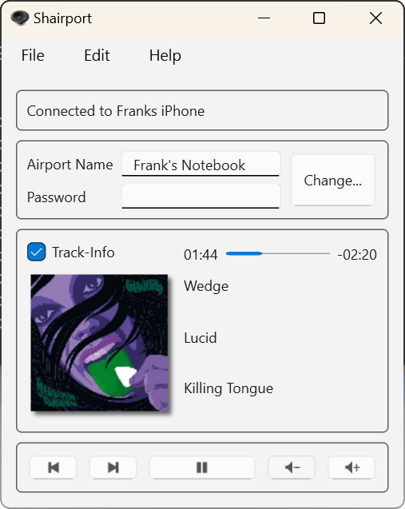

# ShairportQt

An AirPlay Audio-Receiver for your Personal Computer or ARM-SoC (e.g. Raspberry Pi).

Play audio content from your iPhone, iPad, iPod or iTunes on your PC with ShairportQt.
AirPlay lets you wirelessly stream what's on your iOS device whenever you see the AirPlay symbol.

This desktop-software was originally only available for Windows.
But now it's based on `Qt` and is therefore completely portable/cross platform. Additionally many bugs had been fixed - compared to the
previous version (Shairport4w).

Please download pre compiled binaries from [`Releases`](https://github.com/Frank-Friemel/ShairportQt/releases).
When being asked by your Firewall you should grant access to your LAN if secure. Protect ShairportQt with a password
to be sure nobody is misusing this service.

## Installation

ShairportQt consists of a single executable file. So, there's not much to install. Nevertheless I would like to provide
some hints for the several Operating Systems which worked for me. Updating your existing installation please
do the same. 

Once you've downloaded the
[zip](https://github.com/Frank-Friemel/ShairportQt/releases) ... just extract the folder which matches your
OS and follow these instructions:

#### Windows (x64)

Just copy the file `ShairportQt.exe` to your filesystem and create a Desktop-Link. That's it.

Shairport depends on Apple's [`Bonjour`](https://support.apple.com/kb/DL999). Just start `ShairportQt`... it will guide you in case `Bonjour`
is not installed on your machine. Please retry to start `ShairportQt.exe` after
installation of `Bonjour`.

#### Linux (x64)

The installation for Linux depends a bit on your Linux distribution.
I myself am using [`Manjaro-Linux`](https://manjaro.org/)
which worked out of the box and I would expect the same for all KDE based distributions. You'll need at least `Qt 6.7` installed on your machine.

May be anybody of the Linux Pros can give advice how to improve the installation experience with a `.deb` or `.rpm`
package. Comments are appreciated.

The [releases](https://github.com/Frank-Friemel/ShairportQt/releases) package contains an installation script. So, for now you need to unpack the
[zip](https://github.com/Frank-Friemel/ShairportQt/releases) file, open a terminal, change-directory to
`Linux_x64` and start script `install.sh` as superuser:

```shell
chmod a+x install.sh
sudo ./install.sh
```

Afterwards `ShairportQt` application should be available from your start menu.

#### Raspbian (arm64)

The [releases](https://github.com/Frank-Friemel/ShairportQt/releases) package contains an installation script. So, for now you need to unpack the
[zip](https://github.com/Frank-Friemel/ShairportQt/releases) file, open a terminal, change-directory to
`Raspbian` and start script `install.sh` as superuser:

```shell
chmod a+x install.sh
sudo ./install.sh
```

Afterwards `ShairportQt` application should be available from your start menu.

## Problem reports

When you have issues with `ShairportQt` please provide following informations:

- Operating System you're using.
- detailed steps how to reproduce.
- a log file. Which may be enabled from the advanced options dialog. The log file `ShairportQt.log` will be created within your home folder. Alternatively start `ShairportQt` with command line option `-log`.

## Building

`ShairportQt` is a `CMake` project. You'll need a complete c++ development environment and these packages to build it:

- `openssl`
- `spdlog`
- `sockpp`
- `qtbase`
- `gtest`

I recommend to use `vcpkg` in order to get them.
It works very well on Linux and Windows.

On Windows just open `ShairportQt` as CMake project with Visual Studio.
On Linux you may use Visual Studio Code or build from the command line (assumed you're using `vcpkg`):

```shell
git clone https://github.com/Frank-Friemel/ShairportQt.git
cd ShairportQt
mkdir build
cd build
cmake .. -DCMAKE_TOOLCHAIN_FILE=${VCPKG_ROOT}/scripts/buildsystems/vcpkg.cmake -DCMAKE_BUILD_TYPE=Release
cmake --build .
```

### Credits

Thanks to James Laird who implemented the original version of "Shairport".
Special thanks to Japanese Translator [maborosohin](https://github.com/maboroshin).

### Screenshots

<p float="left" align="center">




</p>

### Usage Hints

Click on the time marker to the right of the progress bar to toggle between different display modes.

ShairportQt offers a tray icon which may be
disabled. If the function `Show "Now Playing" in Tray` is switched on, title information will only appear in
the tray if the main window is not visible on the desktop.
To completely hide/restore the main window from the taskbar you have to click
on the tray icon (for `Windows` users, it's a double click). A tray menu
will show up when you right click on the tray icon.

The multimedia buttons at the bottom of the main window are being used to remotely control
your connected device. This also applies to the volume buttons, so it's
*not* your local volume which will increase/decrease.

### Avahi (aka Bonjour)

For Windows you may need to download and install [`Bonjour`](https://support.apple.com/kb/DL999). 
When being asked during the installation ... just dismiss the option to automatically update Bonjour's files in the background. 
Which may save you from having another unnecessary process running on your machine.
A desktop-link for Bonjour is also completely unnecessary.

On my Raspbian ... I had to install `libavahi-compat-libdnssd-dev`.

- `sudo apt install libavahi-compat-libdnssd-dev`

For Linux you may need to enable/start the `avahi-daemon`:

- `sudo systemctl enable avahi-daemon`
- `sudo systemctl start avahi-daemon`

On some Linux distributions you may install `avahi` via their own desktop installation tool. Please see my
Video [Installation of ShaiportQt on Suse](https://youtu.be/UIfek93D5Hw).

